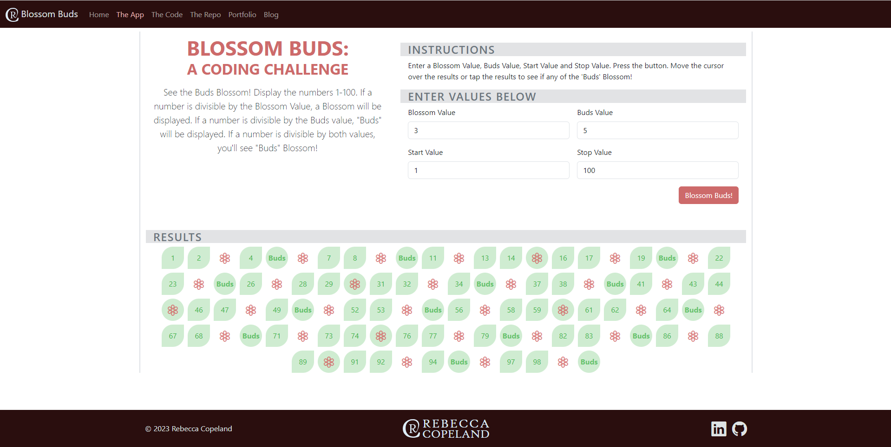

# BlossomBuds - A Coding Challenge
Checkout FizzBuzz like you've never seen before in Blossom Buds!
See the Buds Blossom! Display the numbers 1-100. If a number is divisible by the Blossom Value, a Blossom will be displayed. If a number is divisible by the Buds value, "Buds" will be displayed. If a number is divisible by both values, you'll see "Buds" Blossom!

## Table of contents

- [Overview](#overview)
  - [Screenshot](#screenshot)
  - [Links](#links)a
- [My process](#my-process)
  - [Built with](#built-with)
  - [What I learned](#what-i-learned)
  - [Continued development](#continued-development)
  - [Useful resources](#useful-resources)
- [Author](#author)

## Overview

### Screenshot

Desktop Web App Screenshot:


Mobile Web App Screenshot:


### Links

- Repo URL: [Github Repo](https://github.com/rebcop/BlossomBuds)
- Live Site URL: [Netlify](https://fanciful-bublanina-1545ce.netlify.app/)

## My process

### Built with

- CSS and Bootstrap Layout
- JavaScript Fundamentals
- JavaScript Loops
- JavaScript DOM Manipulation
- Boolean Logic
- TECH STACK: JavaScript, HTML, CSS, Bootstrap

### What I learned

1. Be clear about the purpose of the variable.

This replaces the variable used by the for loop with another value which doesn't allow the for loop to function as expected when the number is replaced with a string.
```js
// generate values from stopValue to startValue
for (let n = startValue; n <= stopValue; n++) {
    
    // check each value
    // if value is a multiple of blossomValue and budsValue
    if (n % blossomValue == 0 && n % budsValue == 0) {

        // add "BlossomBuds" to the array
        n = 'BlossomBuds';

    // if value is a multiple of blossomValue
    } else if ( n % blossomValue == 0) {

        // add "Blossom" to the array
        n = 'Blossom';

    // if value is a multiple of budsValue
    } else if ( n % budsValue == 0 ) {

        // add "Buds" into array
        n = 'Buds';

    } else {
        // value into array
        n = n;

    }
  generatedValues.push(n);
}

This correctly pushes the value into the array without messing with the variable used by the for loop. Another option is to declare another variable before the if-else statement and push that variable into the array.
```js
// generate values from stopValue to startValue
for (let n = startValue; n <= stopValue; n++) {
    
    // check each value
    // if value is a multiple of blossomValue and budsValue
    if (n % blossomValue == 0 && n % budsValue == 0) {

        // add "BlossomBuds" to the array
        generatedValues.push('BlossomBuds');

    // if value is a multiple of blossomValue
    } else if ( n % blossomValue == 0) {

        // add "Blossom" to the array
        generatedValues.push('Blossom');

    // if value is a multiple of budsValue
    } else if ( n % budsValue == 0 ) {

        // add "Buds" into array
        generatedValues.push('Buds');

    } else {
        // value into array
        generatedValues.push(n);

    }

}
```

2. If you use innerHTML to get the contents of an element and assign it to a variable, you will need to reassign it back to the DOM otherwise you're just replacing the string in the variable you retrieved with another string.

For example, this doesn't display the new content on the page:
```js
// reassign contents of HTML to generatedValues with HTML accordingly
let rowHtml = document.getElementById('results').innerHTML;
rowHtml = blossomBudsHtml;    
```

This displays the new content on the page:
```js
// reassign contents of HTML to generatedValues with HTML accordingly
    document.getElementById('results').innerHTML = blossomBudsHtml;
```

### Continued development

- When to use "align-content", "align-items", and "justify-content" with Bootstrap
- How to deal with hover effects when translating to mobile

### Useful resources

- [Bootstrap Docs](https://getbootstrap.com/docs/5.3/getting-started/introduction/)

- [W3 Schools](https://www.w3schools.com/js/default.asp)

- [MDN Web Docs](https://developer.mozilla.org/en-US/docs/Web/JavaScript)

## Author

- Check out my portfolio - [Rebecca Copeland](https://rebcop.dev/)
- Message Me - [@rebcop](https://www.linkedin.com/in/rebcop/)
